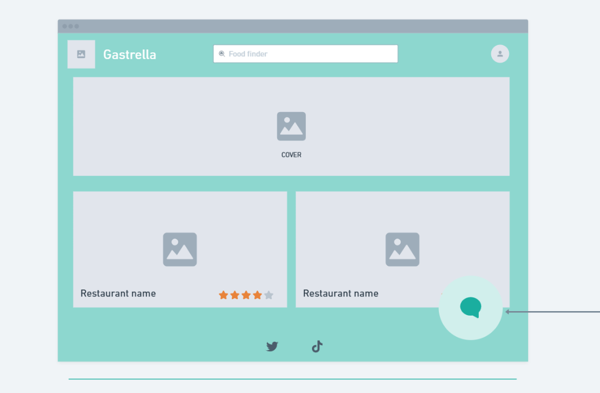
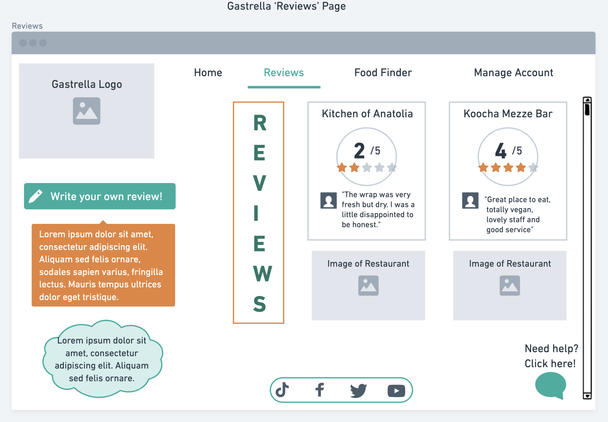
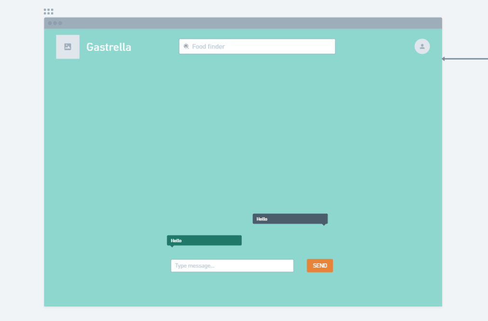
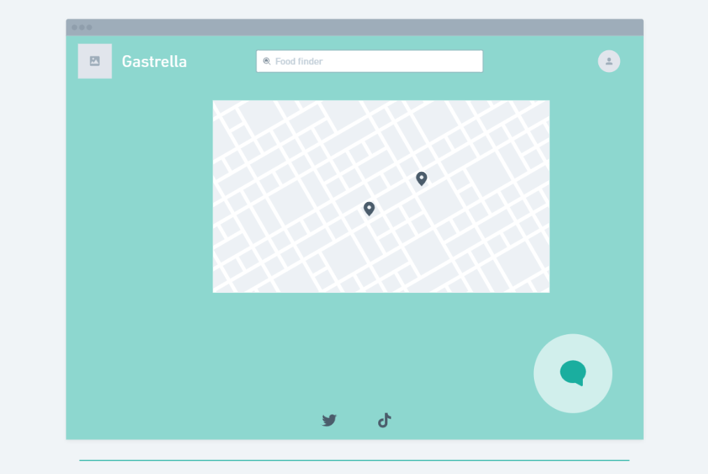

# Design

## User Interface design
Home page wireframe(Paula):
Page that welcomes users and shows them highest rated restaurants in Bristol. 
- The header links back to the home page.
- The restaurants link to it's own review page which is the next wireframe.
- The icon at the right bottom corner links to the chatbot page and that is located in every page except in the chatbot page.
- The food finder at the navigation bar links to the foodfinder page.
- The icon at the navigation bar at the top right links to the manage account page.
- The social media icons at the bottom of every page that link to Gastrella's socials.

Review page wireframe(Farihin):
Page that let's users read and post reviews for the restaurant. 

Chatbot page wireframe(Paula): Assists users through conversations.
- This is a very simple layout for the chatbot. In the bottom centre of the page is where the messages are going to be displayed, with an input section and a button to send the query.

Foodfinder wireframe(Paula): Show near restaurant locations.
- Also a very simple page composed of a map at the centre of the page that indicates the location of these restaurants with markers.  

Manage account wireframe(Farihin): Handle profile management.
- In this page the user can see text fields that they can fill and then click save to sign in or to uupdate information, or cancel the operation.

