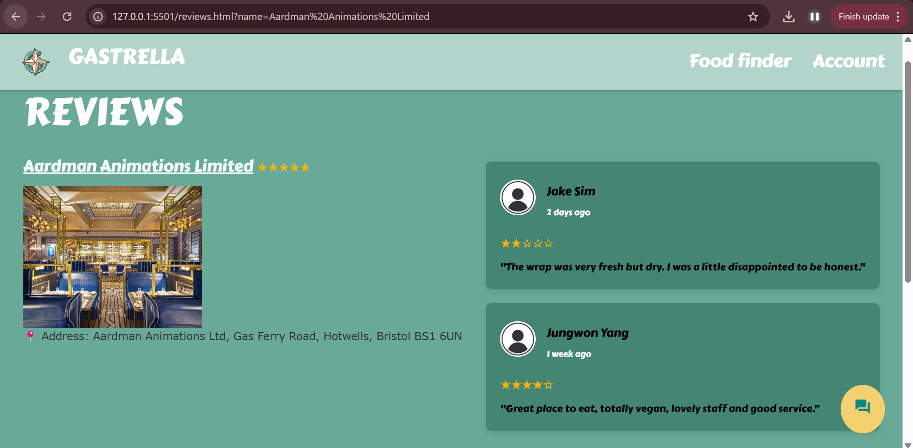

# Implementation

## Introduction
The system employs a dataset containing food hygiene ratings in Bristol.  It includes fields such as; object_ID, business_name, address, business_type, rating, rating_date, and postcode.  The data is stored in an open data platform where we use the API Explorer to retrieve the information required.  The dataset of a recently inspected site is updated at least every 28 days. This is to make sure that there is access to the most recent food hygiene ratings. 

Some issues that may occur is that some records may be labelled as ‘undefined’. This could be due to missing values. Also, there may be delays when a piece of data is too large to run in the web-app. 

The configuration data involved are; API configuration, database configuration, ratings configuration, data update and sync configuration. The API configuration receives the restaurant details and the ratings from Bristol Open Data. The database configuration is the storage for the ratings, and the restaurant details. The data can be filtered for a quick search. The ratings configuration is important so it displays each restaurants’ ratings clearly so that users can use it to quickly make their dining choice. The data update and sync configuration ensures that valid, new inspection data is replacing the older data, without manual updates. 

## Project Structure
An outline of the project folder structure and the role of each file within it.

A table listing the number of jslint warnings/reports for each module.
## CAN'T DO THIS UNTIL JAVASCRIPT IS ADDED

## Software Architecture
The major components of our architecture are Gastrella; the actual web-app itself, and BristolOpenData which is the platform we’re using to access the data we require. 

The architectural styles being used include a colour scheme of pastel green, orange and white. Hygiene is the focus so these represent cleanliness. We used a font of ‘Carter One’, so that the reviews are easy to read. The reviews are measured with the number of stars. This is a quick visual indicator of the highest scoring restaurants. 

## Bristol Open Data API
TODO: Document each query to Bristol Open Data

TODO: Repeat as necessary

# User guide
This guide will help you navigate the website.
1. <b>Home</b>

Search and explore featured restaurants.

2. <b>Chatbot:</b> Navigate to the chatbot page by clicking the icon at the bottom right corner in any page.

Type queries like:
- "how are you?”
- "can you help me?"
- "what is your name?"
- "what are the benefits of a Mediterranean diet?"
- "what are some high protein Indian meals?"
- "how can I write a review?"
- "how do I search for a restaurant?"
- "how can I look for restaurants near me?"

3. <b>Reviews:</b> Open a restaurant's profile.

Scroll through the reviews section.

Fill in the review form and add a rating.

Finally submit it.

