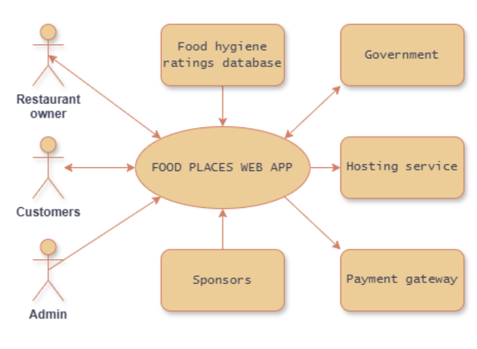

# Project Proposal

## Business Case

### Problem statement
The issue with a lot of food-locator applications is that it excludes people with health and/or visual impairments etc. We are aiming to build a web-app named Gastrella that allows users to engage by sharing reviews and comments so that even people with a restricted range of food can expand their palate without stepping out of their comfort zone. 

There will be a chatbot assistant that provides suggestions for restaurants using the requirements you submit. It is also able to answer any health-related questions that the user may have. Our app gives recommendations based on these reviews, the location, and the food hygiene ratings database.

### Business benefits
- Helps local restaurants improve their visibility.
- Helps people with different preferences, cultures and diets discover new cuisines through personalized recommendations.
- People with disabilities may feel more included by creating new dining experiences.
- The app is unique and targets a wide range of consumers
- Reduced health risks due to the refinements given by the app. 

### Options Considered
Similar leading products are:
- HappyCow
- Zomato
- Zagat

What makes us different from them is that we have an AI chat-bot integrated that provides allergy alerts, while others focus on collaborating with influencers, or on targeting one specific demographic, or on delivery options.

### Expected Risks
- Financial risks: Not generating enough revenue
- Marketing competition: Differentiating our app
- Data security: Handling user data
- Lack of development expertise and time
- Constant updating of data to provide accurate information

## Project Scope
- Enabling businesses and customers to register and manage their profiles.
- Chatbot assistance with professional nutritionist advice about dietry options, allergy alerts, nutrient breakdowns; and customer services.
- Enabling reviews, ratings and feedback forms services.
- Providing official food hygiene ratings, maintaining records and analytics on the server, integrating map location.
- Offering basic security solutions like secure connections and data anonymization.

## Context diagram
  
This diagram represents how the web-app interacts with users and external services. One of the interactions is how the web-app pulls food safety data from the Food Hygiene Ratings Database to display restaurant raitings. This context diagram also comprises the actors: the business owner, customers and the admin/app support team. 
-	The restaurant owner can manage their restaurant details and view reviews. 
-	The customers search for restaurants, read and write reviews.
-	The admin moderates content and manages users.  
The rest of actors are:
-	Government entities that may access data or enforce regulations.
-	Hosting service that ensures the website remains online.
-	Payment gateway that handles transactions for paid features.
-	Sponsors that advertise the platform.

