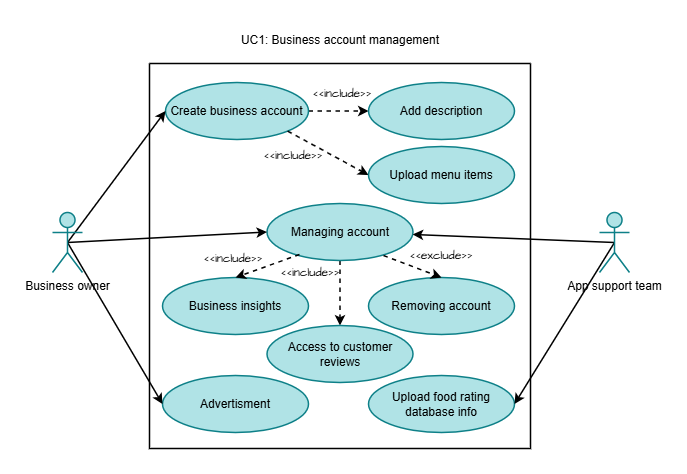
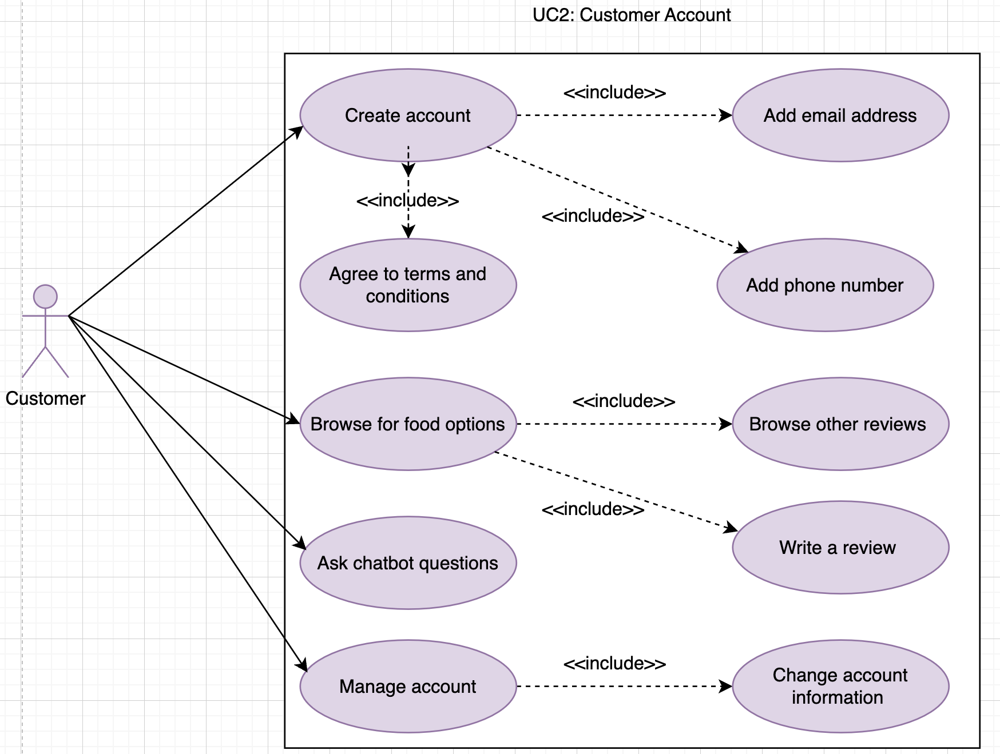

# Requirements

## User Needs

### User stories
- As a business owner I want to showcase the menu of my restaurant so that it can reach more people.
- As a disabled person with food allergies, I want the chatbot to give me personalized recommendations so that I can eat my comfort food outside without having an allergic reaction.
- As a vegan I want to find a new vegan restaurant so I can eat vegan food.

### Actors
- Business owner: They will upload their restaurant's profile and add their details, cuisine type, and menu items.
- Customers: People contributing ratings, insights, and their preferences; and having natural conversations with the bot.
- App support team: They are in charge of managing the app's functionality, security, and user experience.

### Use Cases
| UC1 | Business account mangement(Paula Sanchez) | 
| -------------------------------------- | ------------------- |
| **Description** | This use case explains the features involved in managing a restaurant account |
| **Actors** | Business owner, app support team |
| **Assumptions** | Pre-condition: Owning a restaurant, having an email   Post-condition: Access to account, modification of account</td></tr>
| **Steps** | 1. The business owner creates an account for their restaurant.   2. The owner adds a description with cuisine type, contact information and hours.  3. The owner adds the menu.  4. The app support team uploads the food hygine ratins and the locates establishment in the map from the database.   5. Both the owner and the app support team can respond or monitor customer reviews.  6. Both the owner and the app support team have access to insights data.  7. Both the owner and the app support team can remove the account.   8. The owner can pay for advertisment. |
| **Non-functional** | User-friendly interface, data backup, error handling, data protection |

| UC2 | Customer Account(Farihin Khan) | 
| -------------------------------------- | ------------------- |
| **Description** | This Use Case explains the features involved in having a Gastrella account. |
| **Actors** | Customers with food-related or hygiene quieries including those with health deficiencies. |
| **Assumptions** | Pre-condition: Users' information including name, email address, health conditions (if any), phone number. Agreement to the terms and conditions of the app.  Post-condition: Access to; the Chatbot, account information, and viewing/writing reviews.
| **Steps** | 1. The user creates an account on Gastrella using an email address and further authenticating it with their phone number.   2. The user browses for food options based on reviews, hygiene ratings, customer ratings, recommended, etc.  3. The user can converse with the AI assistant specialised in answering food health-related questions.   4. The user can leave a review and fill in feedback form if the app was satisfactory. |
| **Issues** |1.  Need to regulate customer reviews to ensure its appropriate and unoffensive.  2.  Some customers may be unable to create an account with Gastrella due to Age and/or Location restrictions. |

Use case 1 by Paula Sanchez:  
  

Use case 2 by Farihin Khan:  

## Software Requirements Specification
### Functional requirements    (should be about what the system does specifically)
<u>UC1 requirements:</u>
- FR1: The system must allow restaurant owner registration
- FR2: The system must allow restaurant profile management
- FR3: The system should allow customer interaction
- FR4: Interaction metrics
- FR5: Location and mapping
- FR6: Content moderation
- FR7: Marketing tools

<u>UC2 requirements:</u>
- FR1: The system should allow customers to create an account.
- FR2: The system should allow customers to browse through potential food options.
- FR3: The system should allow users to browse, write and upload reviews for restaurants. 
- FR4: The system should allow users to ask health-related queries to a chatbot.
- FR5: The system should allow users to manage their account, changing any personal information if necessary.

### Non-Functional Requirements
<u>UC1 requirements:</u>
- NFR1: User-friendly interface: New users should be able to complete basic tasks within 4 minutes.
- NFR2: The system must respond within 2 seconds for 85% of user requests.
- NFR3: The system must support multifactor authentification.

<u>UC2 requirements:</u>
- NFR1: The chatbot should provide helpful responses to the users’ queries.
- NFR2: The chat bot response time should be within 3 seconds.
- NFR3: The system should process and display multiple users’ reviews when submitted successfully.
- NFR4: The system should perform automated back ups.
- NFR5: The system should use two-factor authentication for login security.

  
