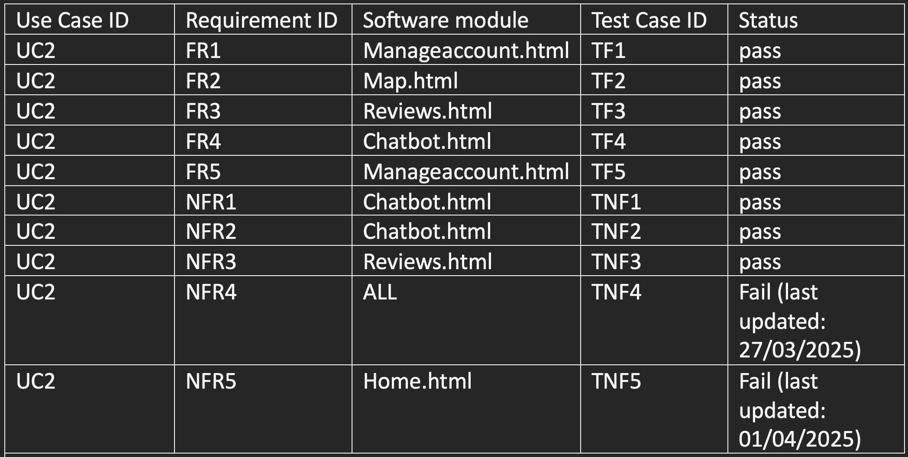

# Testing

## Test Plan
TODO: Describe any manual and automated (unit) tests. Uniquely identify each test case. Include prerequisites and test data.

Test Runs
TODO: For each test described above, indicate the current status. 
Create a requirements traceability matrix to validate the completeness of the product.

| Use-Case ID | Requirement ID | Test Case | Status |
| ----------- | -------------- | --------- | ------ |
| UC1         | FR1            | manageaccount.html|Pass|
| UC1         | FR2            | manageaccount.htm|Fail(data last updated 2/7/25)|
| UC1         | FR3            | reviews.hmtl|Pass|
| UC1         | FR4            | map.html|Pass|
| UC1         | FR5            | reviews.html| Fail(data last updated 2/7/25) |
| UC1         | FR6            | home.html | Fail(data last updated 2/7/25) |
| UC1         | FR7.1            | home.html | Pass |
| UC1         | FR7.2            | reviews.html | Pass |
| UC1         | FR7.3            | map.html | Pass |
| UC1         | NFR1             | ALL | Pass |
| UC1         | NFR2             | ALL | Pass |
| UC1         | NFR3             | manageaccount.html| Fail(data last updated 2/7/25) |

