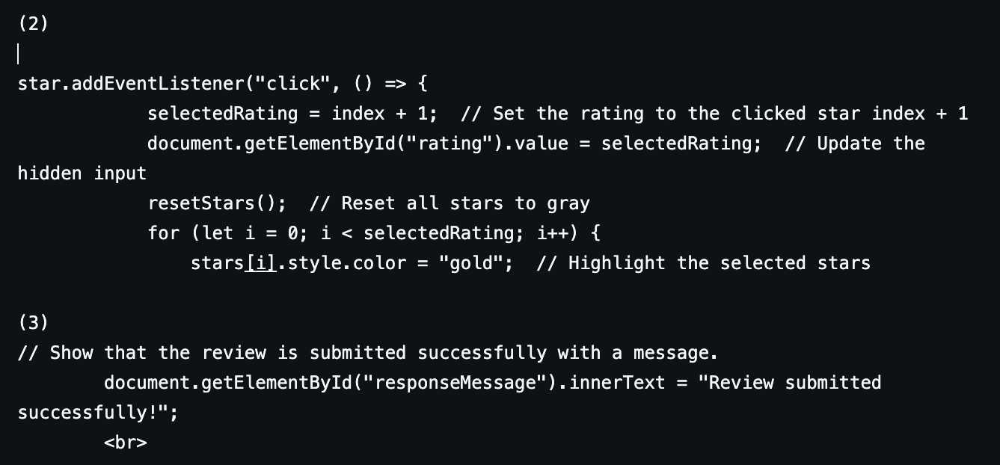
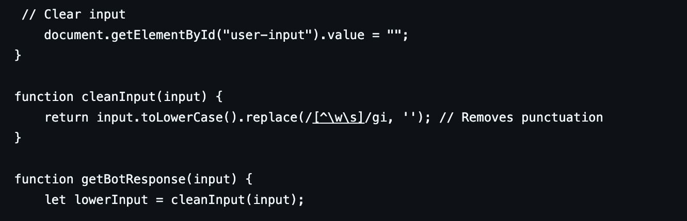

# Testing

## Test Plan
Describe any manual and automated (unit) tests. Uniquely identify each test case. Include prerequisites and test data.

# Manual Tests
### Test Case ID: UC1 FR1 
Description: The system must allow restaurant owner registration (basic profile creation).  
Prerequisites: User's email and phone number, user profile storage 
Test Data: 

        <form id ="account_form">
        

            <label>* Account Owner</label>
            <input type="text" name="name" placeholder="Your name..." required>
        

        

            <label>Phone Number</label>
            <input type="text" name="phone" placeholder="Your number...">
                 
This shows that the restaurant owner can create an account by filling in the required information.

### Test Case ID: UC1 FR2
Description: The system must allow restaurant profile management(changing details or removing account). 
Prerequisites: user profile storage 
Test Data: 

        <form id ="account_form">
        

            <label>* Account Owner</label>
            <input type="text" name="name" placeholder="Your name..." required>
        

        

            <label>Phone Number</label>
            <input type="text" name="phone" placeholder="Your number...">
                 
This shows that the restaurant owner can change some details by filling in the required information.

### Test Case ID: UC1 FR3 
Description: The system should have interaction metrics(customer engagement tracking like viewing reviews). 
Prerequisites:  
Test Data: 

        

                        

                            
                            

                                <h3>Jake Sim</h3>
                                2 days ago
                            

                        

                        

                            ★★☆☆☆
                        

                        

                            "The wrap was very fresh but dry. I was a little disappointed to be honest."
                        

                    

        
This shows that the user can view reviews by clicking on the restaurant's image.
            
### Test Case ID: UC2 FR1 
Description: The system should allow customers to create an account. 
Prerequisites: User's email and phone number, user profile storage  
Test Data: 

        <form id ="account_form">
        

            <label>* Account Owner</label>
            <input type="text" name="name" placeholder="Your name..." required>
        

        

            <label>Phone Number</label>
            <input type="text" name="phone" placeholder="Your number...">
                 
This shows that the customer can create an account by filling in the required information.

### Test Case ID: UC2 FR2
Description: The system should allow customers to browse through potential food options. 
Prerequisites: Accessible API  
Test Data: 
        
                
                <section>
                    <h3 id="restaurant-name2">808 CAFE BAR LTD</h3> 
                    
Fetching type...

                    
Fetching rating...

                    </section>
 
This shows that the customer can browse through food options.

### Test Case ID: UC2 FR3
Description: The system should allow users to browse, write and upload reviews for restaurants. 
Prerequisites: Accessible API, connection to Database, Error messages  
Test Data:  
(1)

                
                <section>
                    <h3 id="restaurant-name2">808 CAFE BAR LTD</h3> 
                    
Fetching type...

                    
Fetching rating...

                </section>
 

              
This shows that the customer can browse (1), write (2), and upload their reviews, showing a response message when uploaded successfully (3). 

### Test Case ID: UC2 FR4 
Description: The system should allow users to ask health-related queries to a chatbot. 
Prerequisites: correct input formatting, response display system, Error messages  
Test Data: 
<!-- Section where all the messages are goint to be in -->
        <section id="message">
            <!-- user and chatbot interactions displayed -->
            

                <!-- chatbot responses -->
                

                <!-- place where the user is going to write -->
                <input type="text" id="user-input" placeholder="Message...">
                <button onclick="sendMessage()">send</button>
            

        </section>
         
This shows that users can ask their questions, and get a generated response from the chatbot.

### Test Case ID: UC2 FR5 
Description: The system should allow users to manage their account, changing any personal information if necessary. 
Prerequisites: user profile storage  
Test Data: 

        <form id ="account_form">
        

            <label>* Account Owner</label>
            <input type="text" name="name" placeholder="Your name..." required>
        

        

            <label>Phone Number</label>
            <input type="text" name="phone" placeholder="Your number...">
                 
This shows that the customer can change some details by filling in the required information.

# Automated Tests
### Test Case ID: UC1 FR4
Description: The system must have location and mapping  
Prerequisites: Access to user's location, access to API  
Test Data:

            <section class="map_frame">
                <iframe id="mapFrame" width="500" height="400" frameborder="0"></iframe>            
            </section>
        
            <button id="find_restaurants" onclick="getLocation('/map.html')">Find Restaurants Near Me</button>

This shows that the user can check restaurants near them by clicking the button.

### Test Case ID: UC1 FR7
Description: FR7: The system must update database information  
Prerequisites: Accessible API, connection to Database, Error messages  

        <article>
                
                <section>
                    <h3 id="restaurant-name1">Aardman Animations ltd</h3> 
                    
Fetching type...

                    
Fetching rating...

                </section>   
            </article> 

This shows the system uses the API to fetch the data.

### Test Case ID: UC1 NFR1 
Description: User-friendly interface: New users should be able to complete basic tasks within 4 minutes.  
Prerequisites: Error handling, Efficient input validation, Minimal UI load time  
Test Data: 

                

                    &#9733;
                    &#9733;
                    &#9733;
                    &#9733;
                    &#9733;
                

                <input type="hidden" id="rating" value="0"> 
                <button id="review-button" type="submit">Submit Review</button>
This shows that the user can perform a basic task, such as submitting a review, efficiently, as the format is easy to understand.

### Test Case ID: UC2 NFR1 
Description: The chatbot should provide helpful responses to the users’ queries.  
Prerequisites: Concise responses, Regular updates, Context awareness  
Test Data: 

    let responses = {
        "hello": "Hi there!",
        "hi": "Hi there!",
        "how are you": "I'm just a simple bot, but I'm good!",
        "can you help me": "Sure, What can I help you with?",
This shows that the chatbot responds to commonly asked questions in an understanding tone.

### Test Case ID: UC2 NFR2 
Description: The chat bot response time should be within 3 seconds.  
Prerequisites: Error handling, Efficient output validation  
Test Data: 

This shows that when the queries' format is processed as correct, the chatbot displays a response efficiently.

### Test Case ID: UC2 NFR3 
Description: The system should process and display multiple users’ reviews when submitted successfully.  
Prerequisites: Valid input data, Efficient data processing  
Test Data:  

            

                
                

                    <h3>${name}</h3>
                    Just now
                

            

            

                ${"★".repeat(rating)}${"☆".repeat(5 - rating)}
            

            

                "${reviewText}"
            

        document.querySelector(".reviews-grid").appendChild(reviewCard);

        // Show that the review is submitted successfully with a message.
        document.getElementById("responseMessage").innerText = "Review submitted successfully!";
This shows that the system displays the review instantly, and in the same format when submitted correctly. It also provides feedback by displaying a message which shows it's submitted successfully.

 

Test Runs

| Use-Case ID | Requirement ID | Test Case | Status |
| ----------- | -------------- | --------- | ------ |
| UC1         | FR1            | manageaccount.html|Pass|
| UC1         | FR2            | manageaccount.htm|Pass|
| UC1         | FR3            | reviews.hmtl|Pass|
| UC1         | FR4            | map.html|Pass|
| UC1         | FR5            | reviews.html| Fail(data last updated 2/4/25) |
| UC1         | FR6            | home.html | Fail(data last updated 2/4/25) |
| UC1         | FR7.1            | home.html | Pass |
| UC1         | FR7.2            | reviews.html | Pass |
| UC1         | FR7.3            | map.html | Pass |
| UC1         | NFR1             | ALL | Pass |
| UC1         | NFR2             | ALL | Pass |
| UC1         | NFR3             | manageaccount.html| Fail(data last updated 2/4/25) |

